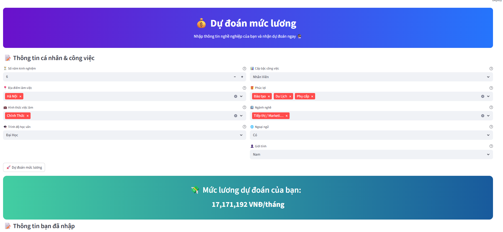

# 💰 Salary Seeker

<div align="center">

[](https://github.com/Dzivilord/Salary_Seeker/stargazers)
[](https://github.com/Dzivilord/Salary_Seeker/network)
[](https://github.com/Dzivilord/Salary_Seeker/issues)
[](LICENSE)
[](https://www.python.org/)

**A data science project predicting salaries based on various factors.**

</div>

## 📖 Overview

This project uses machine learning to predict salaries based on collected data. It involves data crawling, preprocessing, model training, and a user interface for salary prediction.  The target audience is anyone interested in salary prediction, data science, or job market analysis. The key problem solved is providing a tool to estimate potential salary based on various job-related inputs.


## ✨ Features

- **Data Crawling:** Scrapes job data from online sources (details in `crawdata.ipynb`).
- **Data Preprocessing:** Cleans and prepares the data for model training (`dataPreprocessing.ipynb`).
- **Model Training:** Trains a machine learning model to predict salaries (`model.ipynb`).  A pre-trained model (`salary_model.pkl`) is provided.
- **Salary Prediction:**  Predicts salaries using the trained model via a user-friendly Python interface (`main.py` and `UI.py`).
- **Docker Support:**  Includes a `Dockerfile` for easy deployment and reproducibility.


## 🛠️ Tech Stack

**Languages & Libraries:**

- [](https://www.python.org/)
- [](https://jupyter.org/)
- [](https://pandas.pydata.org/)
- [](https://scikit-learn.org/stable/)
- [](https://docs.python.org/3/library/pickle.html)
- [](https://matplotlib.org/)
- [](https://docs.python.org/3/library/tk.html)


**Containerization:**

- [](https://www.docker.com/)

## 🚀 Quick Start

### Prerequisites

- Python 3.x (Ensure you have `pip` installed)
- Required packages:
  ```bash
  pip install -r requirements.txt
  ```

### Installation

1. **Clone the repository:**
   ```bash
   git clone https://github.com/Dzivilord/Salary_Seeker.git
   cd Salary_Seeker
   ```

2. **Install dependencies:** (Already listed above in Prerequisites).


### Running the Application

1. **Run using Python:**
    ```bash
    python main.py
    ```

2. **Running with Docker (Recommended):**

    ```bash
    docker build -t salary_seeker .
    docker run -it salary_seeker
    ```

## 📁 Project Structure

```
Salary_Seeker/
├── UI.py             # User Interface script
├── main.py           # Main script to run the prediction application
├── Utils/            # (Empty directory - Potentially for future utility functions)
├── __pycache__/      # Compiled Python bytecode
├── crawdata.ipynb    # Jupyter Notebook for data crawling
├── dataPreprocessing.ipynb # Jupyter Notebook for data preprocessing
├── model.ipynb       # Jupyter Notebook for model training
├── requirements.txt  # Project dependencies
├── salary_model.pkl  # Trained prediction model
├── salary_scaler.pkl # Scaler for input data
├── Dockerfile        # Docker configuration file
└── LICENSE           # Project license
```

## ⚙️ Configuration

No specific configuration files are used besides the `requirements.txt` file which manages the project's Python dependencies.  The trained model (`salary_model.pkl`) and scaler (`salary_scaler.pkl`) are used for prediction.

## 🧪 Testing

No formal unit tests are included in this repository.  The notebooks contain experiments and analysis, which serve as a form of testing and validation.  Future iterations could include more rigorous testing procedures.

## 🚀 Deployment

The application can be deployed using Docker for easy reproducibility and portability. The `Dockerfile` provides the necessary instructions for building and running the application within a container.

## 📄 License

This project is licensed under the [Apache License 2.0](LICENSE) - see the LICENSE file for details.


---

<div align="center">

**HOW IT GOING**

</div>